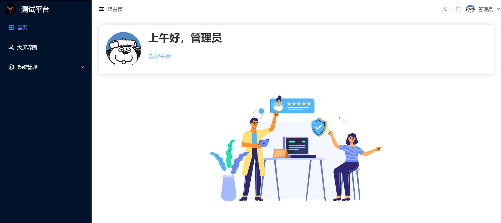
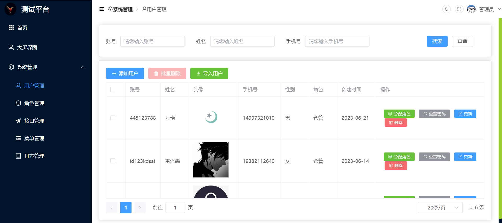
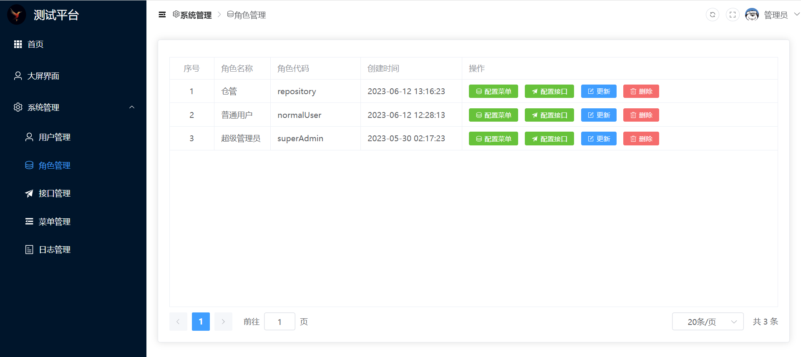
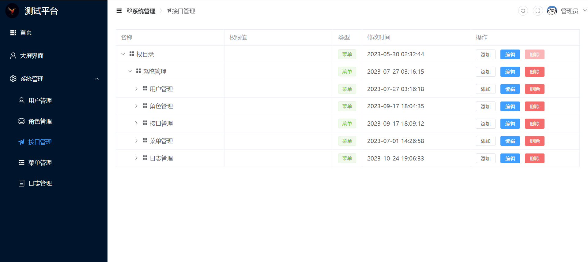
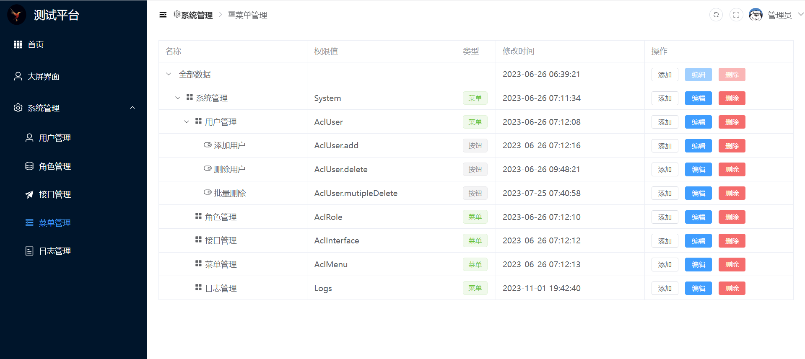
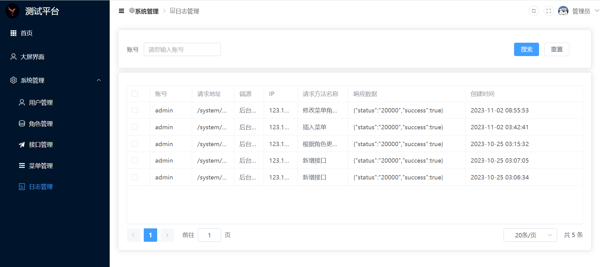

# springboot3_clean

#### 介绍
基于Vue3/Type Script/Element Plus 和Spring Boot3的小微项目个人用模板架构。

<br/><br/>

#### 系统模块

```cmd
springboot3_clean
    ├─boot3-common 			// 通用模块
    ├─boot3-create-code		// 代码生成
    ├─boot3-excel-boot		// excel操作
    ├─boot3-security		// 安全模块
    ├─boot3-test			// 测试模块
    ├─boot3-utils			// 工具类模块
    ├─docker				// docker部分
    └─vue3-front			// 前端代码
```

<br/><br/>

#### 软件架构

| 环境  | 版本  |
| ----- | ----- |
| jdk   | >=17  |
| mysql | >=5.7 |
| redis | >=6   |

<br/><br/>


#### 使用说明

##### 1 yml中myConfig配置相关

```yaml
myConfig:
  useMinio: N          #是否使用minio上传  N是启用本地 Y是启用Minio
  token: 			   #在开发环境中，可以将指定的token配置在这里，从而让token永不过期，但prod环境需要删除该配置
  file:
    frontUploadUrl: D:\Environment\Nginx\nginx-1.15.2\html\    #不使用minio时候的上传路径
```

<br>

##### 2 logback-spring配置

```xml
    <!--定义日志文件的存储地址 勿在 LogBack 的配置中使用相对路径，启动前记得修改为自己的位置-->
    <!--  <property name="LOG_HOME" value="./boot3_logs/logs" />-->
      <property name="LOG_HOME" value="E:/GitWorkSpace/log/logs" />
```

<br>

##### 3 Docker相关

```yml
# 1在Dockerfile中，我将虚拟卷设计为映射到/tmp路径
VOLUME /tmp

# 2因此，在application-prod.yaml中，文件地址同样需要是/tmp
myConfig:
  useMinio: N          #是否使用minio上传
  file:
    frontUploadUrl: /tmp/    #上传路径
    
# 3最终，build镜像并发布的脚本将/tmp映射到nginx路径下，方便在不使用Minio的时候通过地址访问图片
docker run  -d -p 8090:8090   -e LANG=en_US.UTF-8  -e TZ="Asia/Shanghai"  -v /usr/local/nginx/html:/tmp boot3.jar:1.1
```

<br/><br/>

#### 功能预览

> 前端抄的尚硅谷尚品甄选  登录用户名：admin  密码：123456

|  |  |
| ---------------------- | -------------------------------------- |
|  |                  |
|  |                  |
|  |                  |

